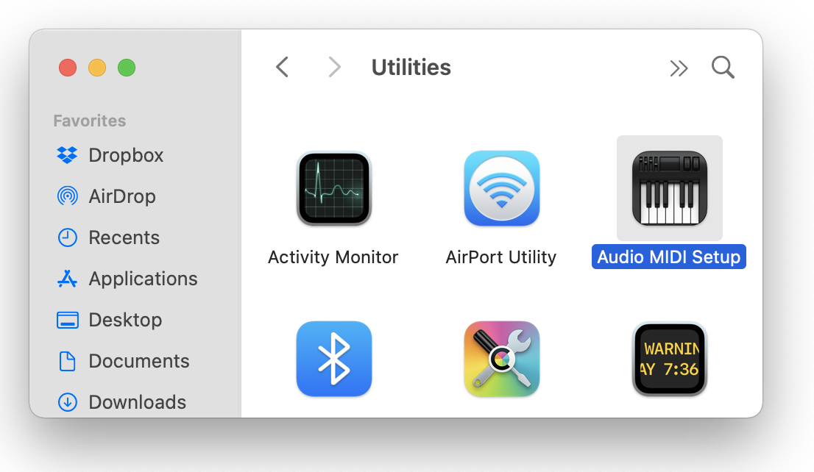

## Midi Setup

- [ ] Install Devices

:one: Install `vmpk` using brew package manager

```
brew install vmpk
```

:two: Install `Sforzando` manually

https://www.plogue.com/products/sforzando.html

:three: Install a bluetooth device on :apple: `Mac`


:bookmark: References [FP-30 Quick Start 07 "Bluetooth"](https://www.youtube.com/watch?v=OtDxVKbbnFo&t=22s)


</img>


- [ ] Install ghci version 8.6.5 see [Installation](http://www.euterpea.com/download-and-installation/) for details (old)

```
% cabal repl
Build profile: -w ghc-8.10.7 -O1
...
```

```
*Jazzkell> import Euterpea
```

```
*Jazzkell Euterpea> devices

Input devices: 

Output devices: 
  OutputDeviceID 0	SimpleSynth virtual input
```


```
*Jazzkell> import Euterpea
*Jazzkell Euterpea> devices

Input devices: 

Output devices: 
  OutputDeviceID 0	sforzando

*Jazzkell Euterpea> play $ line [c 4 qn, c 4 qn, g 4 qn, g 4 qn, a 4 qn, a 4 qn, g 4 hn]
```


