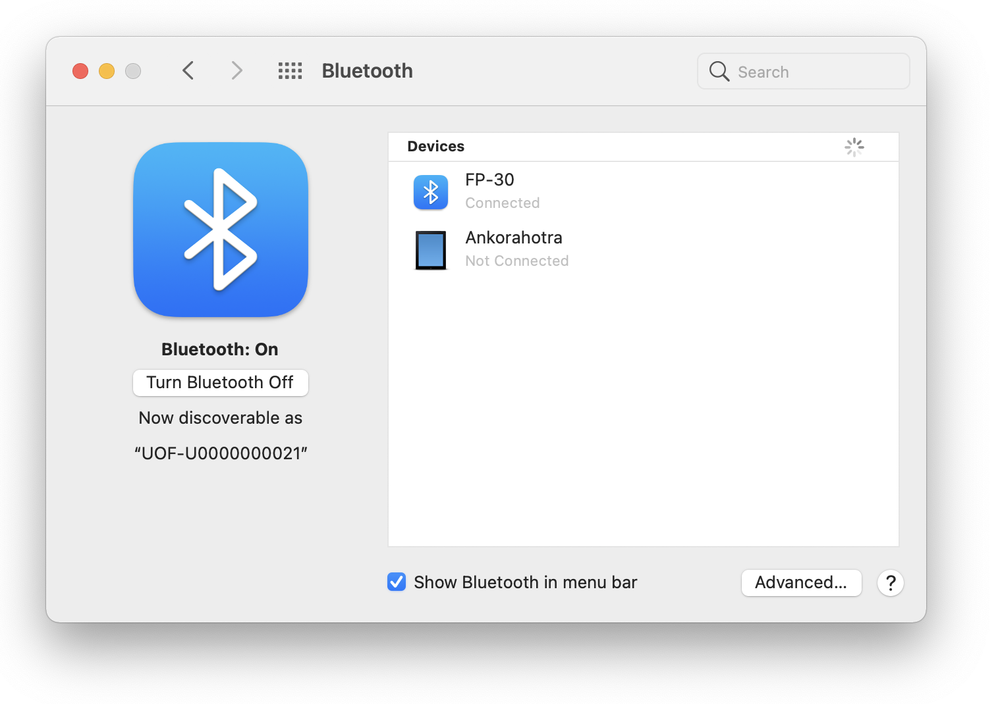
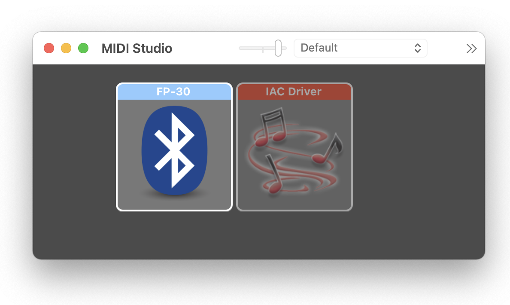
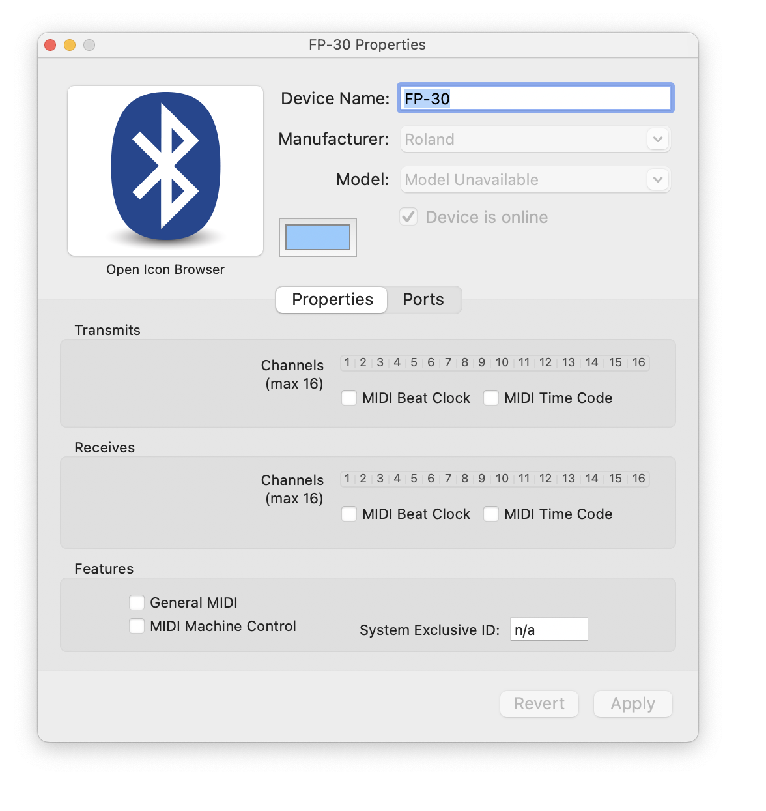

# Midi Setup

## :o: Install Applications

:one: Install `vmpk` using brew package manager

```
brew install vmpk
```

:two: Install `Sforzando` manually

https://www.plogue.com/products/sforzando.html


## :a: Install Devices 

:zero: Install a bluetooth device on :apple: `Mac`

- [ ] Enable `bluetooth` on a device - for example the [Roland FP-30](https://www.roland.com/ca/products/fp-30/)

* Switch the Device on
* press `Function` key and `A0` key together to put Midi `On` (`A1` to Switch `Off` Midi)
* press `Function` key and `C1` key together to `Transmit` and `Receive` MIDI messages

:bookmark: References [FP-30 Quick Start 07 "Bluetooth"](https://www.youtube.com/watch?v=OtDxVKbbnFo&t=22s)

- [ ] Connect the `bluetooth` device through the Mac's `System Preference`

</img>


</img>

</img>

</img>

</img>


- [ ] Install ghci version 8.6.5 see [Installation](http://www.euterpea.com/download-and-installation/) for details (old)

```
% cabal repl
Build profile: -w ghc-8.10.7 -O1
...
```


```
*MyLib> import Euterpea

*MyLib Euterpea> devices

Input devices: 
  InputDeviceID 0	FP-30 Bluetooth
  InputDeviceID 1	VMPK Output

Output devices: 
  OutputDeviceID 2	FP-30 Bluetooth
  OutputDeviceID 3	VMPK Input
  OutputDeviceID 4	sforzando
```

```
*MyLib Euterpea> play $ line [c 4 qn, c 4 qn, g 4 qn, g 4 qn, a 4 qn, a 4 qn, g 4 hn]
```

```
*MyLib Euterpea> playDev 4 $ line [f 4 qn , f 4 qn, e 4 qn, e 4 qn, d 4 qn, d 4 qn, c 4 wn ]
```
